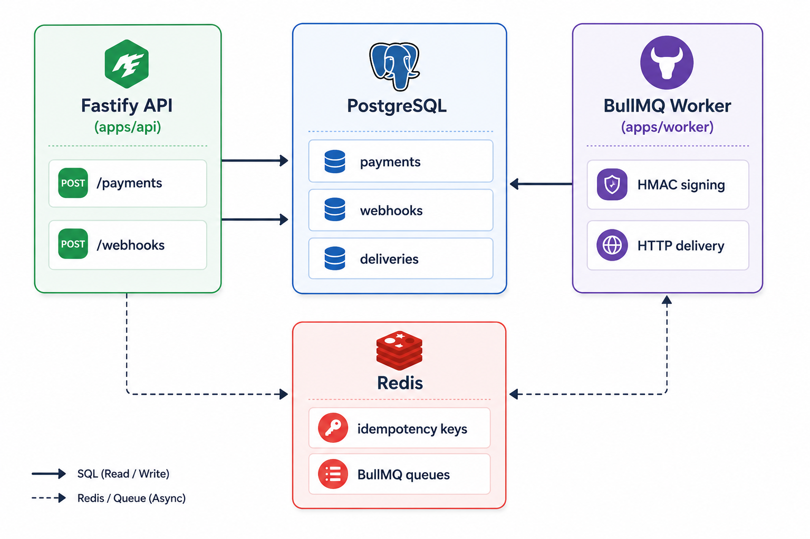

# Fintech Payment Processing API

Production-grade payment processing API demonstrating idempotency, webhook
delivery with exponential backoff, and distributed job processing.

**Stack:** Node.js · TypeScript · Fastify · PostgreSQL · Redis · BullMQ · Docker

---

## Status

**Deployed and live.**

- API: https://fintechapi-production-f9a7.up.railway.app
- Health check: https://fintechapi-production-f9a7.up.railway.app/health
- Swagger docs: https://fintechapi-production-f9a7.up.railway.app/docs
- Infra: Railway (PostgreSQL + Redis + API + Worker services)

```bash
curl https://fintechapi-production-f9a7.up.railway.app/health
# {"status":"ok","postgres":"ok","redis":"ok","uptime":<seconds>}
```

> **Note:** This runs on Railway's free trial credit, which is usage-based
> and finite — not a renewing monthly quota. If the live link is
> unresponsive, the credit may have been exhausted. Reach out and I'll
> redeploy, or check `docs/DECISIONS.md` for the infra notes.

---

## Architecture

   

### Key patterns

**Idempotency** — Every payment endpoint requires an `x-idempotency-key`
header. Redis `SET NX EX` provides sub-millisecond deduplication on the hot
path. PostgreSQL `UNIQUE` index is the correctness guarantee if Redis misses.

**Atomic transactions** — Payment creation and webhook delivery record
insertion happen inside a single PostgreSQL transaction. Either both commit
or neither does. Webhook jobs are enqueued only after a successful commit.

**At-least-once delivery** — BullMQ retries failed webhook deliveries with
exponential backoff (1s, 2s, 4s, 8s, 16s). Each attempt is tracked in
`webhook_deliveries` with status, error message, and next attempt time.

**Payload signing** — Every webhook delivery is signed with HMAC-SHA256
using a per-webhook secret. Signature sent in `X-Webhook-Signature: sha256=<hex>`.

---

## Project structure

```
fintech-payment-api/
├── apps/
│   ├── api/          # Fastify HTTP server
│   └── worker/       # BullMQ webhook delivery worker
├── packages/
│   └── shared/       # Domain types, DB client, services, queue definitions
├── docker/
│   └── docker-compose.yml  # PostgreSQL + Redis for local dev
└── docs/
    ├── ARCHITECTURE.md
    └── DECISIONS.md
```

---

## Local development

**Prerequisites:** Node.js 20+, Docker Desktop

```bash
# Clone and install
git clone https://github.com/Kola92/fintech-payment-api.git
cd fintech-payment-api
npm install

# Environment
cp docker/.env.example .env

# Start infrastructure
docker compose -f docker/docker-compose.yml up -d

# Run migrations
npm run migrate

# Start API (terminal 1)
npm run dev:api

# Start worker (terminal 2)
npm run dev:worker
```

API available at `http://localhost:3000`
Swagger UI at `http://localhost:3000/docs`

---

## API reference

All endpoints (except `/health`) require `x-api-key` header.

### Payments

| Method | Endpoint | Description |
|--------|----------|-------------|
| `POST` | `/api/v1/payments` | Create payment (requires `x-idempotency-key`) |
| `GET` | `/api/v1/payments` | List payments |
| `GET` | `/api/v1/payments/:id` | Get payment by ID |

### Webhooks

| Method | Endpoint | Description |
|--------|----------|-------------|
| `POST` | `/api/v1/webhooks` | Register webhook endpoint |
| `GET` | `/api/v1/webhooks` | List registered webhooks |
| `DELETE` | `/api/v1/webhooks/:id` | Remove webhook |
| `GET` | `/api/v1/payments/:id/deliveries` | Delivery history for a payment |

### Health

| Method | Endpoint | Description |
|--------|----------|-------------|
| `GET` | `/health` | PostgreSQL + Redis liveness check |

---

## Webhook delivery

When a payment is created, the API:
1. Finds all active webhooks subscribed to `payment.created`
2. Creates a `webhook_delivery` record per webhook (inside the payment transaction)
3. Enqueues a BullMQ job per delivery after successful commit

The worker:
1. Signs the payload with `HMAC-SHA256` using the webhook's secret
2. POSTs to the registered URL with `X-Webhook-Signature` header
3. On failure — updates delivery record, lets BullMQ retry with backoff
4. On success — marks delivery as `delivered`, records timestamp

### Verifying signatures (receiver side)

```javascript
const crypto = require('crypto');

function verifyWebhook(payload, signature, secret) {
  const expected = crypto
    .createHmac('sha256', secret)
    .update(JSON.stringify(payload))
    .digest('hex');
  return `sha256=${expected}` === signature;
}
```

---

## Design decisions

See [docs/DECISIONS.md](docs/DECISIONS.md) for full ADR log covering:
- Why Fastify over Express
- Why raw SQL over an ORM
- Why Redis for idempotency (not PostgreSQL)
- Why enqueue after commit (not inside the transaction)
- Why shared queue definitions prevent silent failures
- A Railway build-cache incident during deployment and how it was diagnosed

---

## Author

**Adekola Olawale** — Senior Full-Stack Engineer, Lagos Nigeria
- GitHub: [@Kola92](https://github.com/Kola92)
- Medium: [@Adekola_Olawale](https://medium.com/@Adekola_Olawale)
